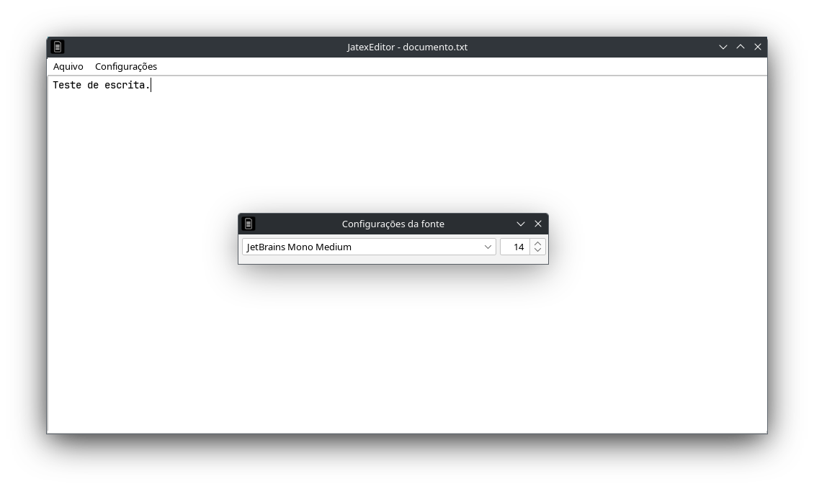

# JatexEditor, um editor simples escrito em Java
A aplicação JatexEditor é um editor de texto simples feito usando Java Swing, como um projeto simples.

A única biblioteca externa utilizada no aplicativo é [FlatLaf](https://github.com/JFormDesigner/FlatLaf), biblioteca open-source usada para modernizar a aparência padrão do Swing.

Foi utilizado, como fonte padrão, o [JetBrains Mono](https://www.jetbrains.com/lp/mono/), também open-source.

A ferramenta de buid utilizada foi o ***[Apache Maven](https://maven.apache.org/)***.

## Imagens demonstrativas da interface





## Build

Para construir o aplicativo é simples: é necessário somente possuir (Apache Maven[https://maven.apache.org/](makefile é opcional)

Simplesmente vá para o diretório onde está o arquivo *pom.xml* e digite na linha de comando ```mvn packge```, será gerado o diretório "*target*", onde estará o arquivo *jatexteditor-1.0.jar*, só executar o arquivo jar e pronto.